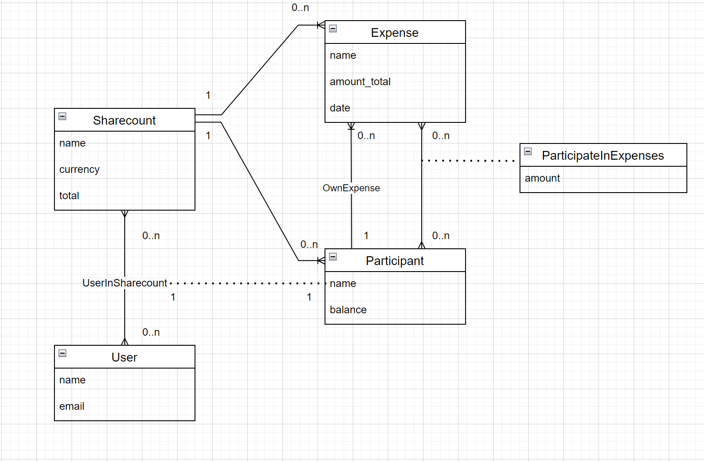

# Sharecount PWA App - Server

## Description
Sharecount is the solution for organizing group expenses on the web or mobile.<br>

This is the app's server-side code in Typescript.

<div align="center">
    
</div>


## Built With
- [NestJS](https://nestjs.com/) (v8.0.0)
- [Prisma](https://www.prisma.io/) (v4.4.0)
- [PostgreSQL](https://www.postgresql.org/) (v11.0.0)


## Getting started

> **Prerequisites** <br>
> Node.js

```bash
# Install dependencies
$ npm install

# Running the app: development
$ npm run start

# Running the app: watch mode
$ npm run start:dev

# Running the app: production mode
$ npm run start:prod
```

Navigate to [Swagger](http://localhost:3000/api/)


## Prisma
```bash
# Setup a new Prisma project
$ npx prisma init

# Generate artifacts (e.g. Prisma Client)
$ npx prisma generate

# Create migrations from your Prisma schema, apply them to the database, generate artifacts (e.g. Prisma Client)
$ npx prisma migrate dev

# Seed the database
$ npx prisma db seed

# Reser and seed the database
$ npx prisma migrate reset

# Pull the schema from an existing database, updating the Prisma schema
$ npx prisma db pull

# Push the Prisma schema state to the database
$ npx prisma db push
```

## Load local data to Heroku
### Make a backup
```bash
docker exec postgres pg_dump -U admin database > backup.sql

# Generalized:
docker exec [container-name] pg_dump -U [user] [password] > [file-name].sql
```
 
### Load the sql file to the server
```bash
heroku pg:psql --app sharecount-api < ./backup.sql

# Generalized:
heroku pg:psql --app [app-name] < ./[file-name].sql
```
